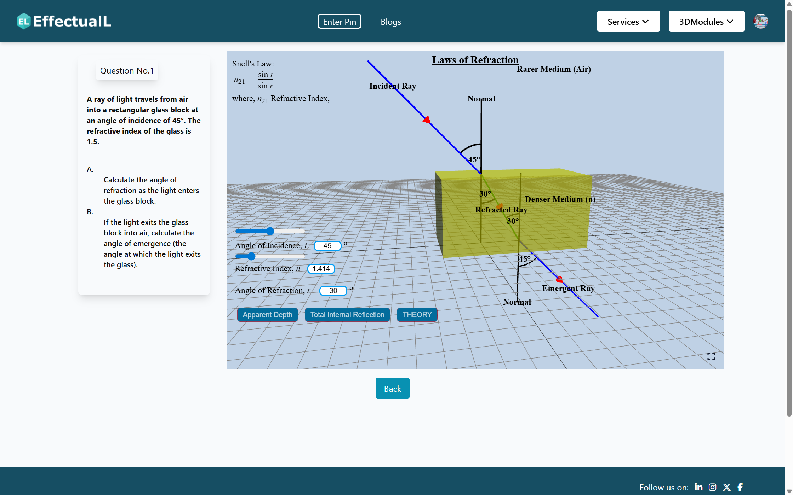

# EffectualL Docs Template 

This is a template for creating documentation and blogs

[**Live Demo →**](https://effectuall.com)

## Quick Start

What is Effectual Learning?

## STEM Module Development

Why is visual elements needed for STEM conceptualization?

## Data Privacy & Usage Policy

How we are supporting learner agency.

